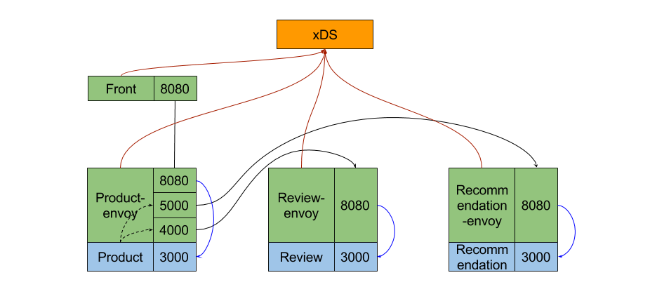

# Sample Envoy Mesh with xDS

This is a sample application used to demonstrate the envoy mesh.



## Components

* Product service

The `product` service serves two APIs, `GET /products` to get a product list without product review and recommendations, `GET /product-list` to get product as well as its reviews and recommendations. Aka, the second API depends on `review` and `recommendation` services.

* Review service

It provides an API: `GET /reviews?ids=<product ids>`.

Given a product id list, returns the product review records.

* Recommendation service

It provides an API: `GET /recommendations?ids=<pids>`.

Given a product id list, returns the relative recommendations.

## Run

```bash
docker-compose up
```

## Test

```bash
http get localhost:8080/product-list
```

To change the envoy configuration, you can modify `data.json`, `xds` will automatically reload the file and the envoy instances will pull the latest configuration every 10 seconds.

## Request Tracing

Open [Zipkin](http://localhost:9411), select `front` service and click `Find Traces`. You will see a request with 3 spans.
